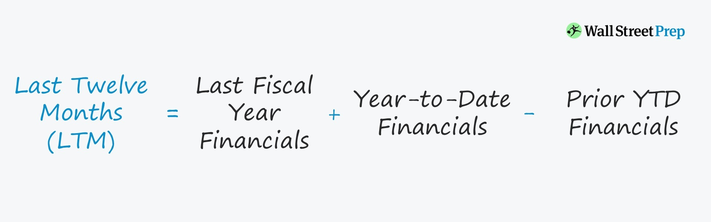

This project is built in three parts.

> 1. Importer

Importer is used to download and unzip bulk archive ZIP files of public companies from the [U.S. Securities and Exchange Commision website](https://www.sec.gov/edgar/sec-api-documentation).

> 2. Updater

Updater is responsible for making sense of the data from the previous step. It establishes a connection to a local database and stores relevant data.

Importer and Updater are both background services apps that can run indefinitely on the background and do their job to download and process new daily filings.

> 3. Magic Formula App (frontend)

The app itself will consume the data stored in the database and provide meaningful screens to find attractive stocks to invest into.

[Useful information and commands for this project](Shared/README.md)

# Other information

How last twelve months operating income is calculated according to this [website](https://www.wallstreetprep.com/knowledge/last-twelve-months-ltm/).

