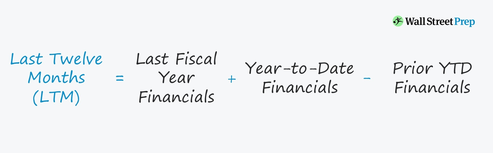

# Migrations Commands

dotnet ef migrations add InitialCreate

dotnet ef migrations add InitialCreate --context PostgresCompanyData --output-dir Migrations/PostgresMigrations

dotnet ef migrations remove

dotnet ef migrations remove --context PostgresCompanyData

dotnet ef database update

dotnet ef database update --context PostgresCompanyData

Unapply migrations:

dotnet ef database update 0

dotnet ef database update 0 --context PostgresCompanyData

For SQL Server Management Studio or other programs, use this string to open the server connection: (localdb)\MSSQLLocalDB

# Useful commands

Don't forget to set your FinancialModelingPrep API key and Max requests per day after creating the database:

USE [MagicFormulaApp]
GO

INSERT INTO [dbo].[Fmp]
           ([ApiKey]
           ,[MaxRequestsPerDay]
           ,[RequestsToday],
           [MinimumTimeinSecondsToUpdateMarketCapitalizations])
     VALUES
           ('API_key',
           250,
           0,
           86400)
GO

Get your free API key at:
https://site.financialmodelingprep.com/developer/docs/dashboard

SELECT TOP (1000) [Id]
      ,[CIK]
      ,[Ticker]
      ,[Exchange]
      ,[CompanyName]
      ,FORMAT([LastMarketCapitalization] / 1000, 'C') AS [LastMarketCapitalization] -- Format as currency
      ,FORMAT([CashAndCashEquivalents] / 1000, 'C') AS [CashAndCashEquivalents]
	  ,FORMAT([CurrentAssets] / 1000, 'C') AS [CurrentAssets]
      ,FORMAT([PropertyPlantAndEquipment] / 1000, 'C') AS [PropertyPlantAndEquipment]
      ,FORMAT([Assets] / 1000, 'C') AS [Assets]
      ,FORMAT([TotalDebt] / 1000, 'C') AS [TotalDebt]
	  ,FORMAT([Liabilities] / 1000, 'C') AS [Liabilities]
      ,FORMAT([OperatingIncome] / 1000, 'C') AS [OperatingIncome]
      ,FORMAT([NetCurrentAssets] / 1000, 'C') AS [NetCurrentAssets]
      ,FORMAT([TangibleAssets] / 1000, 'C') AS [TangibleAssets]
      ,FORMAT([EmployedCapital] / 1000, 'C') AS [EmployedCapital]
      ,FORMAT([EnterpriseValue] / 1000, 'C') AS [EnterpriseValue]
      ,FORMAT([ReturnOnEmployedCapital], 'P') AS [ReturnOnEmployedCapital] -- Format as percentage
      ,FORMAT([OperatingIncomeToEnterpriseValue] , 'P') AS [OperatingIncomeToEnterpriseValue]
      ,[LastFilingDate]
      ,[LastMarketCapitalizationDate]
  FROM [MagicFormulaApp].[dbo].[Companies]

# Other information

How last twelve months operating income is calculated:

Link: https://www.wallstreetprep.com/knowledge/last-twelve-months-ltm/